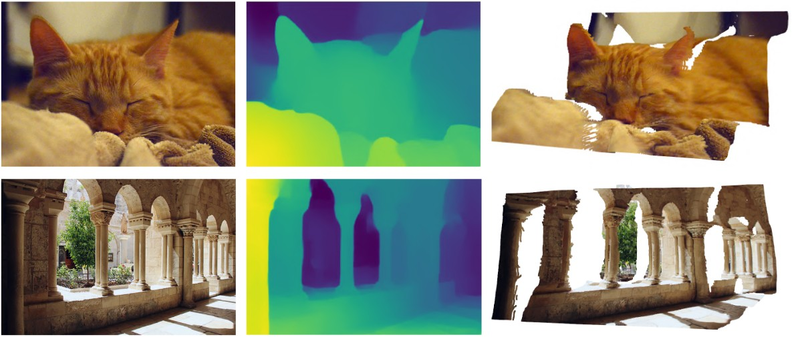

# Towards General Purpose, Geometry Preserving Single-View Depth Estimation [[Paper]](https://arxiv.org/abs/2009.12419) [[Weights]](https://github.com/saic-vul/geometry-preserving-de/releases/tag/v1.0) [[Video]](https://youtu.be/mzNmHpzIPWo)

----
This repository provides official code (Python+Pytorch) to run models from the "Towards General Purpose, Geometry Preserving Single-View Depth Estimation" paper:

> **Towards General Purpose Geometry-Preserving Single-View Depth Estimation**<br>
> Mikhail Romanov, Nikolay Patatkin, Anna Vorontsova, Sergey Nikolenko, Anton Konushin, Dmitry Senyushkin <br>
> Samsung Research <br>
> https://arxiv.org/abs/2009.12419



Also you may consider watching [video](https://youtu.be/mzNmHpzIPWo) with the additional results (animated point cloud renders) and comparisons with existing single-view depth estimation models. 


## Set up an environment

To set up an anaconda environment, use the following commands:

    conda create -n efficient-de python=3.7
    conda activate efficient-de
    conda install pytorch==1.5.1 torchvision cudatoolkit=10.2 -c pytorch
    pip install -r requirements.txt

## Checkpoints

We release weights of our final models trained on a mixture of 4 datasets ([RedWeb](https://sites.google.com/site/redwebcvpr18) + [DIML Indoor](https://dimlrgbd.github.io/) + [MegaDepth](http://www.cs.cornell.edu/projects/megadepth/) + Stereo Movies). Download desired checkpoints from the links below to the `weights/` folder:

| Encoder        | Decoder | Link                        | NYU | TUM | Sintel | DIW | ETH3D |Params| TFLOPS*  |
|----------------|---------|-----------------------------|-----|-----|--------|-----|-------|------|---------|
| MobileNetV2    | LRN | [mn-lrn4.pth](https://github.com/saic-vul/geometry-preserving-de/releases/download/v1.0/mn_lrn4.pth) |14.64|15.13| 0.360  |15.02| 0.191 | __2.4__  | __1.17__    |
| EfficientNet-Lite0| LRN | [lite0-lrn4.pth](https://github.com/saic-vul/geometry-preserving-de/releases/download/v1.0/lite0_lrn4.pth)|14.15|14.41|0.354|14.59|0.177| 3.6  | 1.29    |
| EfficientNet-B0| LRN | [b0-lrn4.pth](https://github.com/saic-vul/geometry-preserving-de/releases/download/v1.0/b0_lrn4.pth) |13.84|15.95| 0.330  |13.15| 0.168 | 4.2  | 1.66    |
| EfficientNet-B1| LRN | [b1-lrn4.pth](https://github.com/saic-vul/geometry-preserving-de/releases/download/v1.0/b1_lrn4.pth) |12.80|15.03| 0.315  |12.71| 0.179 | 6.7  | 2.22    |
| EfficientNet-B2| LRN | [b2-lrn4.pth](https://github.com/saic-vul/geometry-preserving-de/releases/download/v1.0/b2_lrn4.pth) |13.04|15.36| __0.304__  |13.06| 0.168 | 8    | 2.5     |
| EfficientNet-B3| LRN | [b3-lrn4.pth](https://github.com/saic-vul/geometry-preserving-de/releases/download/v1.0/b3_lrn4.pth) |12.35|14.38| 0.343  |12.95| 0.176 | 11   | 3.61 |
| EfficientNet-B4| LRN | [b4-lrn4.pth](https://github.com/saic-vul/geometry-preserving-de/releases/download/v1.0/b4_lrn4.pth) |11.92|13.55| 0.346  |12.81| 0.164 | 18   | 5.44 |
| EfficientNet-B5| LRN | [b5-lrn4.pth](https://github.com/saic-vul/geometry-preserving-de/releases/download/v1.0/b5_lrn4.pth) |__10.64__|__13.05__| 0.328  |__12.56__| __0.154__ | 29   | 8.07 |

* TFLOPS are estimated for a single 384x384 image input

For NYU, TUM datasets delta-1 metrics are given, for Sintel, ETH3D - relative errors, DIW - WHDR (Human Disagreement Rate)


## Usage
Model list: `mn_lrn4`, `lite0_lrn4`, `b0_lrn4`, `b1_lrn4`, `b2_lrn4`, `b3_lrn4`, `b4_lrn4`, `b5_lrn4`.

To run inference on an image folder use the following command:

    python inference.py --src-dir <your-image-folder-path> --out-dir output/ --vis-dir vis/ --model b5_lrn4

By default, this would create individual PyTorch `.pth` files with model predictions in `log-disparity` domain for each image. For convenience, you can also specify `--domain` flag
and change to `disparity` (like MiDaS), `depth` (like most models trained on sensor-based conventional datasets) and `log-depth` (MegaDepth, Mannequin etc.) domain.

## Evaluation

1. Download and prepare evaluation datasets:
    * __NYUv2__. For evaluation official test split is used. You can download data from http://horatio.cs.nyu.edu/mit/silberman/nyu_depth_v2/nyu_depth_v2_labeled.mat (654 images)
    * __TUM__. Here we use the evaluation subset proposed by Li et al. in "Learning the Depths of Moving People by Watching Frozen People" capturing people in an indoor environment. Download https://storage.googleapis.com/mannequinchallenge-data/tumtest/tum_hdf5.tgz and unpack the file. (1815 images)
    * __DIW__. Test subset images and annotations can be downloaded from http://www-personal.umich.edu/~wfchen/depth-in-the-wild/ page.    
    * __Sintel__. Download training set images from http://sintel.is.tue.mpg.de/downloads and depth from http://sintel.is.tue.mpg.de/depth (1064 images total, 19 of them - with depth strictly larger than 72 meters). Leave two folders - "final" and "depth". 
    * __ETH3D__.  The original depth provided by the dataset is sparse. We rendered depth maps from clean point clouds for evaluation purposes, given intrinsics and extrinsic at 4x less resolution than the original images. Our preprocessed version of dataset can be downloaded from [link](https://github.com/saic-vul/geometry-preserving-de/releases/download/v1.0/eth3d.zip)
    
2. Unpack data and place to common folder so that it forms the following structure:
   
    ```
   data-folder/
         nyu_depth_v2_labeled.mat
         TUM/
            <file-id>.h5
         sintel/
            final/
            depth/
         DIW/
            DIW_test/
            DIW_test.csv
         ETH3D/
   ```
   
   Specify path to your data-folder in `config.py`
   
3. Run script: `python eval.py --model b5_lrn4`.By default, the script will evaluate the model on all datasets (NYU, TUM, ETH3D, Sintel, DIW). 
   You can specify datasets you need explicitly: `python eval.py --ds nyu tum eth3d --model b5_lrn4`. 
 

## Citation

If you find this work is useful for your research, please cite our paper:
```
@article{geometricde2021,
      title={Towards General Purpose Geometry-Preserving Single-View Depth Estimation}, 
      author={Mikhail Romanov and Nikolay Patatkin and Anna Vorontsova and Sergey Nikolenko and Anton Konushin and Dmitry Senyushkin},
      year={2021},
      eprint={2009.12419}
}
```
